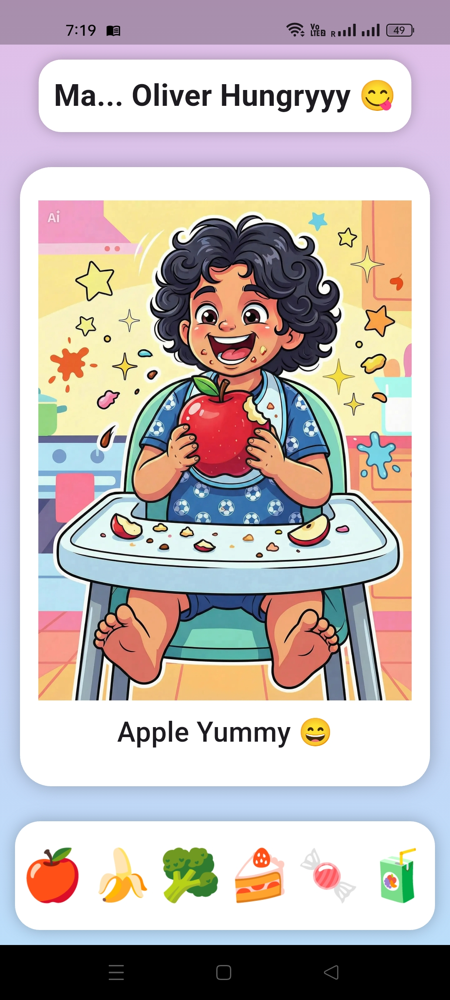

# Ma... Oliver Hungryyy 😋

A fun and interactive Flutter game for toddlers to learn healthy eating habits!

## 🎯 Features

- 🍎 Feed healthy foods (Apple, Banana, Broccoli)
- 🍰 Avoid junk foods (Cake, Candy, Juice)
- 😄 Character reactions (Happy / Sad)
- 🔊 Sound effects for feedback
- 🎮 Drag and drop gameplay
- 🧸 Kid-friendly UI design

---

## 📱 Screenshots

## Home Screen 📱

  

## Healthy Foods 🍎🍌🥦

  

## Junk foods 🍰🍬🧃

  

---